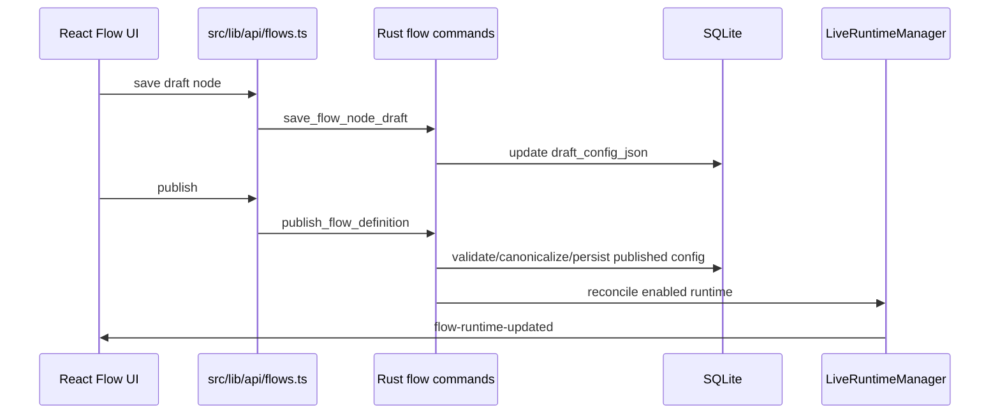
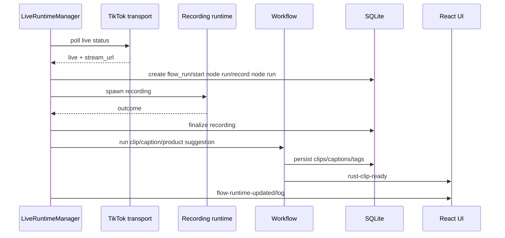

# Data flow

Status: Canonical  
Owner: Engineering  
Last reviewed: 2026-05-03  
Code refs:
- `/Users/monkira/Tiktok_App_reup/src/components/layout/app-shell-effects.ts`
- `/Users/monkira/Tiktok_App_reup/src/lib/api`
- `/Users/monkira/Tiktok_App_reup/src-tauri/src/live_runtime/manager`
- `/Users/monkira/Tiktok_App_reup/src-tauri/src/workflow`

## Flow edit to runtime

## Live to clip

## Shell sync

`app-shell-effects.ts` lắng nghe events và bump/refetch stores liên quan. Event payload không nên được xem là persistent state đầy đủ; DB-backed commands vẫn là nguồn đọc durable state.

