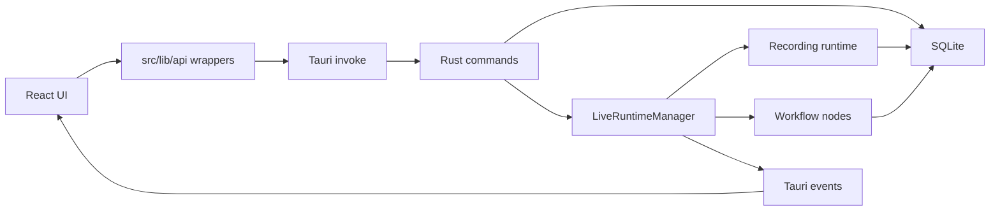

# Tổng quan architecture

Status: Canonical  
Owner: Engineering  
Last reviewed: 2026-05-03  
Code refs:
- `/Users/monkira/Tiktok_App_reup/src`
- `/Users/monkira/Tiktok_App_reup/src-tauri/src`

## Purpose

TikClip dùng React cho desktop UI, Tauri làm IPC boundary, Rust làm owner của runtime và SQLite. Frontend hiển thị, gọi commands, lắng nghe events và quản lý state UI; Rust xử lý durable mutations, live polling, recording, workflow, TikTok integration, storage và notifications.

## Layer ownership

- Frontend: UI, local optimistic state, form parsing/serialization, event listeners, API wrappers.
- Tauri commands: boundary mỏng; validate input, lock DB khi cần, gọi module Rust đúng chuyên môn.
- SQLite: durable state duy nhất cho accounts, flows, runs, recordings, clips, products, notifications, settings.
- Live runtime: in-memory sessions, poll tasks, active recordings, runtime logs và event emission.
- Recording runtime: ffmpeg input/output, process spawn/cancel/finalize.
- Workflow: start/record/clip/caption/upload node behavior, runtime persistence, product suggestion.
- Storage: storage root, file usage, cleanup, quota warnings.

## Data flow cấp cao

## Invariants

- Durable writes đi qua Rust commands/runtime/workflow, không ghi SQLite từ frontend.
- `src/components/layout/app-shell-effects.ts` là nơi bootstrap/sync runtime events chính của shell.
- Flow pipeline là closed pipeline, không phải arbitrary graph.
- Timestamps được lưu theo GMT+7 helpers trong Rust/SQLite migrations hiện có.
- Media paths phải nằm trong storage root trừ khi là remote URL được UI render có chủ đích.

## Docs liên quan

- Frontend: `frontend.md`
- Tauri boundary: `tauri-boundary.md`
- Runtime: `rust-runtime.md`
- Storage/time: `storage-and-time.md`
- Data flow chi tiết: `data-flow.md`

